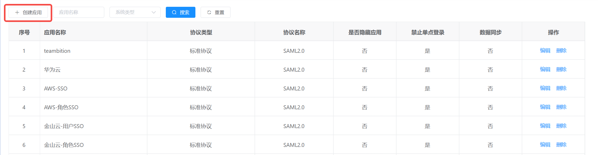
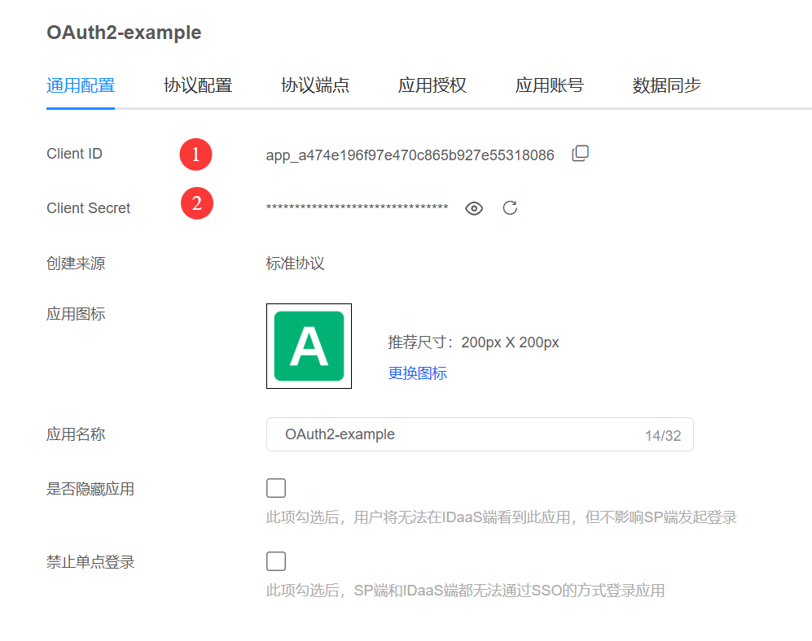
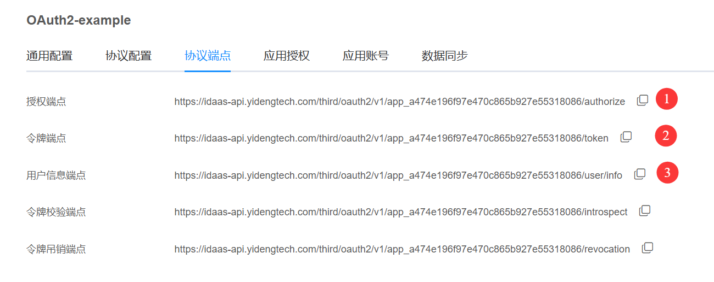
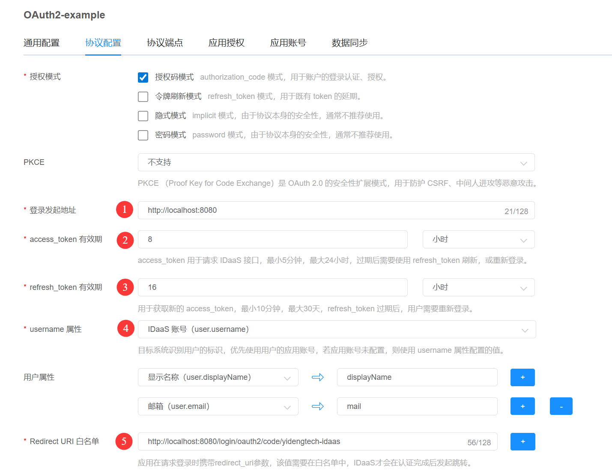
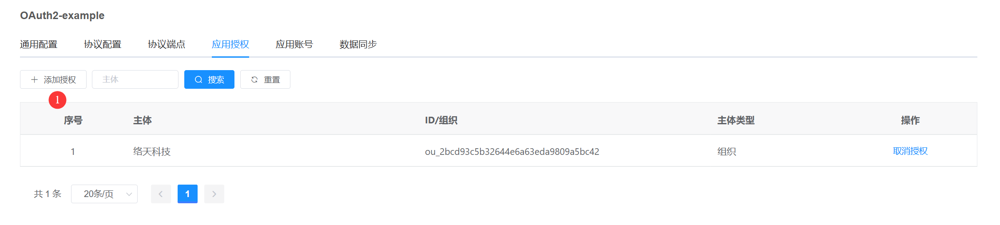
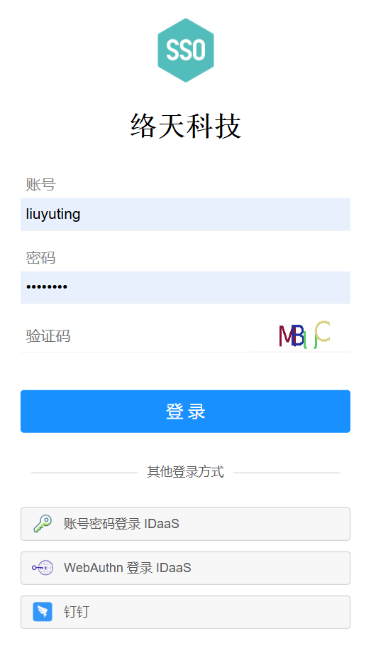
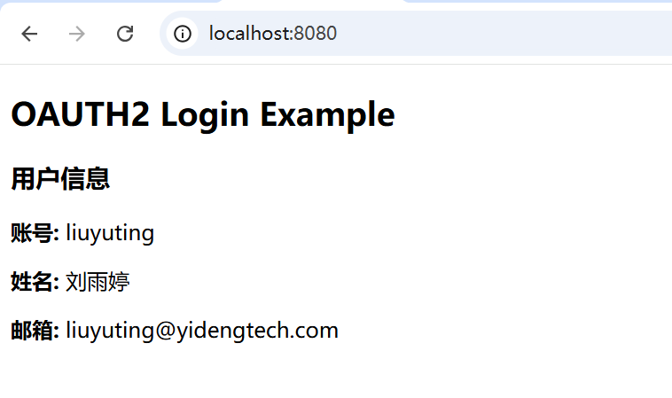

# Spring Boot OAuth2.0 单点登录(SSO)实战教程：授权码模式详解与主流IAM厂商对接

这是一个基于springboot，使用OAuth2协议实现单点登录的完整示例，源码下载后开箱即用。

本文将手把手教您如何使用 OAuth2.0 协议 实现企业级 单点登录 (Single Sign-On, SSO) 的身份认证。无论您的应用需要对接自己的统一身份认证平台，还是要对接第三方IDP，或对接 Keycloak、Okta、Auth0、AWS Cognito、Microsoft Entra ID，本教程提供的标准 授权码 模式 (Authorization Code Flow) 配置步骤均能完美适配。

更多信息，[您也可以点击此处，详细了解OAuth2.0协议各模式的时序和参数](https://www.yidengtech.com/221.html)。

## 为什么这是您需要的SSO教程？
在开发 OAuth2.0 单点登录 功能时，直接对接国际主流授权服务器（如 Okta, Auth0, AWS Cognito）常让国内开发者面临三大痛点：
- 网络延迟高：访问外网服务响应慢，导致 SSO 调试过程极其耗时。
- 环境不稳定：跨国网络连接波动，影响 OAuth2.0 授权码模式 的回调测试。
- 沟通成本高：遇到配置问题时，缺乏及时的中文技术支持。

为了解决这些问题，本 SSO教程 特别采用国内领先的 亿登科技 IDaaS (EIAM) 作为授权服务器进行演示。亿登IDaaS 完全遵循 OAuth2.0 标准协议，其 授权码模式 的实现逻辑与 Keycloak、AAD 等国际大厂高度一致。学会本教程，即可举一反三，轻松完成任意主流厂商的集成。
## 🚀 快速开始：1分钟获取免费OAuth2.0测试环境
👉 立即访问 [亿登科技官网](https://www.yidengtech.com/)
- 极速注册：仅需 1分钟 即可快速注册免费账号。
- 开箱即用：预置标准 OAuth2.0 应用模板，完美支持 授权码模式。
- 国内加速：专为国内开发者优化，彻底替代外网 Okta/Auth0/AWS 进行高频调试，效率提升10倍。
## 本OAuth2.0教程涵盖的核心技术点
- 协议深度解析：图解 OAuth2.0 核心配置流程，重点剖析 授权码模式 的安全性与交互时序。
- 通用SSO集成步骤：适用于 Keycloak, Okta, Auth0, AWS Cognito, Azure AD (Entra ID) 的标准配置方法论。
- 亿登IDaaS实战演练：如何在控制台创建OIDC/OAuth2.0应用、获取 Client ID/Client Secret 并配置回调地址 (Redirect URI)。
- 代码级落地：提供完整的后端验证代码示例，助您快速打通 SSO单点登录 闭环。

无论您是在寻找 Keycloak 的替代方案，还是需要在上线前对 AWS Cognito 配置进行本地验证，这篇 OAuth2.0教程 都将为您提供一套高效、通用且免费的 单点登录企业级身份认证 解决方案。

### 步骤 1：登录 IDaaS 控制台
- 亿登 IDaaS 控制台登录地址：https://console.yidengtech.com/

### 步骤 2：创建应用
创建一个标准协议的 OAuth2.0 应用

<table>
   <tr>
      <td style="border: 1px solid black; padding: 0;">
         
       </td>
   </tr>
</table>

### 步骤 3：修改配置

修改`application.yml`中 OAuth2.0 的相关配置项

```yaml
spring:
  security:
    oauth2:
      client:
        registration:
          yidengtech-idaas: # 自定义 provider id
            client-id: # 你的应用在 IDaaS 平台注册后分配的 Client ID（应用ID）
            client-secret: #（应用ID）对应的 Client Secret（应用密钥），注意保密
            scope: user.read # 请求的权限范围（scopes），目前只支持 user.read
            redirect-uri: # 授权服务器回调地址（即登录成功后重定向到你应用的地址）
            client-authentication-method: post # 客户端调用 token endpoint 的方式
            authorization-grant-type: authorization_code # 授权码模式
        provider:
          yidengtech-idaas:
            authorization-uri: # 授权端点地址（Authorization Endpoint）
            token-uri: # 获取 Access Token 的接口地址（Token Endpoint）
            user-info-uri: # 获取用户信息的接口（User Info Endpoint）
            user-name-attribute: # 从 UserInfo 响应中提取哪个字段作为用户名
```

参考下面2张图的标示，完成上面配置文件的修改。

<table>
   <tr>
      <td style="border: 1px solid black; padding: 0;">
         
       </td>
   </tr>
</table>

<table>
   <tr>
      <td style="border: 1px solid black; padding: 0;">
         
       </td>
   </tr>
</table>

下面是修改后的配置，仅供参考
```yaml
spring:
  security:
    oauth2:
      client:
        registration:
          yidengtech-idaas:
            client-id: app_a474e196f97e470c865b927e55318086  #应用id
            client-secret: e37d7155533f4270857faca7cd3aae46  #应用秘钥
            scope: user.read
            redirect-uri: "{baseUrl}/login/oauth2/code/{registrationId}"
            client-authentication-method: post
            authorization-grant-type: authorization_code
        provider:
          yidengtech-idaas:
            authorization-uri: https://idaas-api.yidengtech.com/third/oauth2/v1/app_a474e196f97e470c865b927e55318086/authorize
            token-uri: https://idaas-api.yidengtech.com/third/oauth2/v1/app_a474e196f97e470c865b927e55318086/token
            user-info-uri: https://idaas-api.yidengtech.com/third/oauth2/v1/app_a474e196f97e470c865b927e55318086/user/info
            user-name-attribute: username
```


### 步骤 4：在 idaas 中添加 sp 配置

- 登录发起地址：是本地应用的访问地址。
- access_token 有效期、refresh_token 有效期，根据您的实际情况填写。
- username 属性：SP应用的用户标识
- 用户属性（可选）
- Redirect URI 白名单：是 IDaaS 认证完成后跳转回本地应用的地址，格式：{baseUrl}/login/oauth2/code/{registrationId}，本地调试请填写：http://localhost:8080/login/oauth2/code/yidengtech-idaas


<table>
   <tr>
      <td style="border: 1px solid black; padding: 0;">
         
       </td>
   </tr>
</table>

### 步骤 5：应用授权

配置那些用户有权限登录此应用

<table>
   <tr>
      <td style="border: 1px solid black; padding: 0;">
         
       </td>
   </tr>
</table>

### 步骤 6：用户登录

- 访问 `http://localhost:8080`，完成登录。

<table>
   <tr>
      <td style="border: 1px solid black; padding: 0;">
         
       </td>
   </tr>
</table>

### 步骤 7：登录成功

- 用户登录成功后会跳转到原地址：`http://localhost:8080`

<table>
   <tr>
      <td style="border: 1px solid black; padding: 0;">
         
       </td>
   </tr>
</table>
